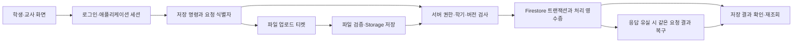

# 서버 저장 장애 점검 — 2026-09-16

## 확인한 원인

운영 화면과 운영 서버가 서로 다른 저장 계약을 사용하고 있었다. 9월 15일 Vercel의 운영 도메인은 `main`의 `9c68015a277d5fdb863c74cbc8ba167310d7fbd0`을 제공했다. 이 화면은 대부분 Firestore/Storage에 직접 쓰지만, 이미 배포된 서버와 보안 규칙은 세션 증명을 포함한 서버 명령을 요구한다.

실제 사용자 수업자료 화면의 콘솔에서도 `Missing or insufficient permissions`를 확인했다. `ManageLesson.saveTree`의 직접 쓰기는 운영 규칙의 `curriculum/tree` 쓰기 금지와 충돌한다. 같은 형태의 저장·업로드 호출은 구형 화면 `src` 38개 파일의 113곳에서 확인했다. 이 수는 정적 호출 위치이며 실제 사용자 작업 수나 모두 실패한 요청 수가 아니다.

수정된 화면은 이미 `codex/phase6-w10p-presentation-freeze`의 `d360227`에 있었다. 따라서 보안 규칙을 완화하는 대신 이 구현과 최신 달력 수정을 통합한 화면을 복구한다.

## 실제 운영 상태와 대조

- 운영 Firestore 규칙: `1f1d3e24-5af9-49fa-8ffd-7416784218eb`, 2026-09-12 적용.
- 운영 Storage 규칙: `67af9629-5f1f-4eb9-9b6b-6924f053b145`, 2026-09-12 적용.
- 두 규칙 원문은 `d360227`과 개행 정규화 후 동일하다.
- 최신 서울 `executeCommand` 배포 소스를 직접 내려받아 비교했다. 수업·지도·답안·세션·권한 등 런타임 모듈 44개가 후보 기준과 동일했다. 별도 조회 리전과 배너 함수도 실제 배포 목록에서 확인했다.
- 개별 함수의 소스 압축파일은 그 함수가 마지막 배포된 시점의 묶음이다. 오래된 `adjustTeacherPoints` 소스를 전체 서버의 현재 버전으로 간주하지 않았다.
- 운영 함수는 서울 77개, 미국 4개였으며 조회용 추가 리전과 기존 서울 주소를 구분했다.
- 운영 학기는 2026학년도 2학기이며 활성 포인터 revision은 1이다.
- 현재 학기 `calendar` 22건은 모두 공휴일이었다. 구형 화면의 최근 일반 일정 저장 경로에는 일반 일정이 없어 데이터 이전을 하지 않았다.
- 루트와 현재 학기 각각 `curriculum/tree`가 없고 `lessons`는 0건이었다. 루트 자료를 읽지 않는 복구 화면 때문에 기존 수업자료가 누락되는 사례는 이 조회에서 발견하지 않았다. 다른 학기 자료를 삭제하거나 변경하지 않았다.

읽기 조사는 설정·배포 소스·규칙·필요한 집계에 한정했다. 학생 자료 본문, 인증 토큰, 비밀값을 보고서에 포함하지 않았다.

## 저장 구조별 결론

복구 화면의 공통 저장 흐름은 다음과 같다. 영역별 전용 함수도 동일한 인증·권한·학기 검사를 유지한다.

| 영역 | 구형 운영 화면의 문제 | 복구 구현 |
| --- | --- | --- |
| 로그인·공통 저장 | Firebase 로그인만 확인하고 서버 세션 증명을 보내지 않음 | 애플리케이션 세션 준비 후 `_session`을 붙여 호출 |
| 수업 트리·본문 | 차단된 Firestore 경로에 직접 저장 | `saveLessonTree` / `saveLessonDocument`, 학기·revision 검사 |
| PDF·각주·지도·사료창고 | 차단된 Storage 직접 업로드 | 서버 업로드 티켓, 소유자·파일·첨부 검증 후 저장 |
| 학생 학습지 답안 | 직접 쓰기와 단순 오류 안내 | 답안 명령, 응답 유실 시 동일 요청 재시도·결과 복구 |
| 생각모아 | 세션과 활성 포인터를 따로 저장 | 서버 명령 안에서 상태 전환·응답 처리 |
| 퀴즈·역사교실 | 결과와 제출 상태 부분 저장, 실패 시 legacy 재저장 가능 | `submitAssessmentAttempt`의 원자적 제출과 재전송 보호 |
| 성적·위스 | 구형 쓰기 경로와 현재 서버 계약 불일치 | 검증된 명령·영수증·권한 경로 사용 |
| 일정 | 최근 임시 호환 함수와 정식 일정 경로가 다름 | 기존 W8 일정 경로 유지, 최근 색상·휴일 수정 통합 |
| 설정·학기 | 설정 읽기 실패 후 2026/1 기본값으로 쓰기 가능 | 보호 레이아웃에서 설정 누락 차단, 서버의 현재 학기 검사 |
| 개발자 일지 | 최근 인증을 요구하는 규칙과 달리 저장 전 재인증 누락 | 기존 재인증 흐름을 작성·수정·삭제에 연결, 계정 변경 시 후속 쓰기 차단 |

성적 계산기의 개인 계산값은 이 버전에서 브라우저 로컬 저장이다. 서버 저장 기능으로 검증하거나 기기 간 동기화를 보장하지 않는다.

## 수행한 검증

`d360227` 기준으로 다음 기존 검증을 실행해 통과했다. 모의 저장소 기반 검증과 운영 브라우저 검증은 구분한다.

- 수업 저장 복구: 중복 실행, 화면 이탈, 소유자·학기 변경, 저장 충돌, 첨부 및 동일 요청 재시도.
- 학생 답안 저장 복구 30개 사례, 수업 학기 격리.
- 직접 쓰기 경계 검사: 승인된 경계 153개, 미분류 0개.
- 생각모아 갱신 10개 실행 사례와 화면 연결 검사.
- 서버 수업 저장 30개, 지도 관리 11개, W8 영역 108개, 성적 근거 122개, 위스 49개 사례.
- 평가 생애주기: 시작·제출 원자성, 동시 제출, 마감·학기·권한 경계.
- 실제 Firestore·Storage 에뮬레이터: 수업 배포 규칙 74개, 콘텐츠 학기 규칙 300개 통과. 운영·스테이징 변형 모두 검사했으며 실제 운영 데이터에는 쓰지 않았다.
- 요청 재시도 복구 15개, 설정 재인증 복구 20개, 교사 운영 명령 34개, 학생 등록 접근 19개, 사료창고 관리 58개 사례와 사료창고 편집 복구 통과.
- 수업 첨부 16개, 전송 22개, 지도 전송 8개, 보존 첨부 선택 9개 사례와 조회 리전·일정 대상 검사 통과.
- 개발자 일지 최종 회귀 26개 통과. 실제 페이지·인증 경계·이미지 helper 코드를 실행하는 모의 hook 환경에서 화면 제거/재생성, 초안·첨부 복구, 재인증 취소, 저장 실패, 이미지 처리 중 계정 변경을 검사했다. 저장 중에는 제목·본문·첨부·취소를 잠가 진행 중인 내용과 복구 초안이 달라지지 않게 했으며, 저장 완료 후 이전 첨부 정리가 실패하더라도 새 첨부를 지우거나 저장 실패로 표시하지 않도록 검증했다. 새 글은 ID만 미리 할당하고 첨부 준비가 끝난 뒤 한 번에 게시하여, 업로드·게시 실패 후 재시도해도 미완성 글이나 중복 글이 남지 않는지 검사했다. 운영 브라우저 인증 자체는 이 검사의 범위 밖이다.

최종 통합 소스의 빌드·타입·달력·개발자 일지 검사와 운영 도메인 복구 후 저장·재조회 결과는 배포 완료 시 추가 기록한다.

## 재발 방지와 검증 범위

운영 도메인을 이전 `main`이 다시 덮어쓰지 않도록 Vercel의 자동 도메인 할당을 조정하고, 서버와 호환성이 확인된 후보만 운영에 승격한다. 프런트 배포 성공만으로 Functions·보안 규칙·데이터 계약이 일치한다고 간주하지 않는다.

이 감사는 전체 저장 구조와 주요 영역의 회귀 검증을 포함하지만 모든 계정·모든 브라우저·모든 기존 데이터 조합에서 저장 실패가 없다는 보장은 아니다. 실제 운영 사용자 동작을 확인하지 못한 항목은 자동 검증 결과와 구분한다. 운영 학생 기록이나 점수에 시험 데이터를 작성해 검증하지 않는다.
